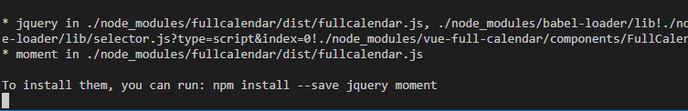
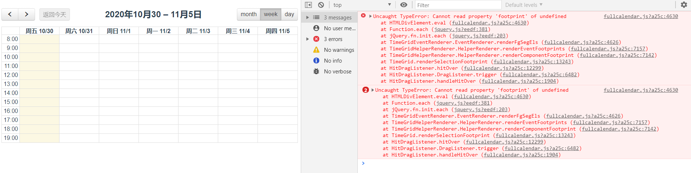
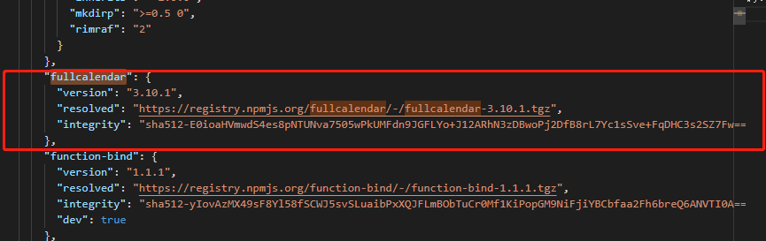
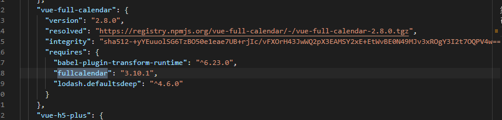
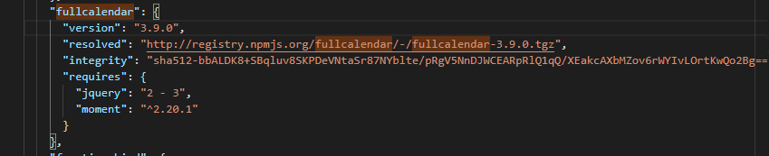
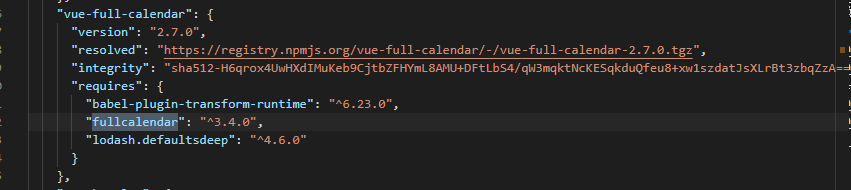
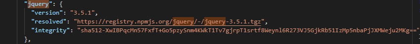
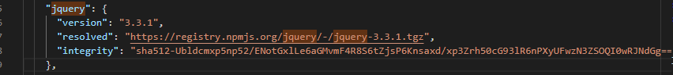
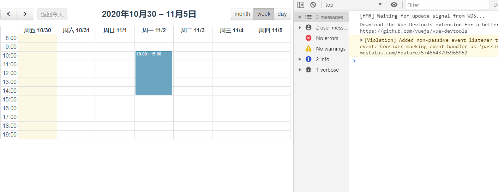

# 关于vue-cull-calendar在应用中的一些问题
## 目前已知的该组件在周视图时,存在无法选中的bug
### 具体在下载完vue-full-calendar依赖包，运行程序时会提示安装jquery moment依赖包，如下：

* 如按提示安装相应的依赖时，周视图无法选中，结果如下：

* 故在遇到上面提示时不可安装以上依赖包，如已安装请移除并删除相应的node-modules，打开package-lock.json,全局查找fullcalendar，找到以下代码：
以及

* 修改以上代码，选择低一点的版本，具体修改如下：
以及
具体代码如下：
```
    "fullcalendar": {
      "version": "3.9.0",
      "resolved": "http://registry.npmjs.org/fullcalendar/-/fullcalendar-3.9.0.tgz",
      "integrity": "sha512-bbALDK8+SBqluv8SKPDeVNtaSr87NYblte/pRgV5NnDJWCEARpRlQ1qQ/XEakcAXbMZov6rWYIvLOrtKwQo2Bg==",
      "requires": {
        "jquery": "2 - 3",
        "moment": "^2.20.1"
      }
    },
    "vue-full-calendar": {
      "version": "2.7.0",
      "resolved": "https://registry.npmjs.org/vue-full-calendar/-/vue-full-calendar-2.7.0.tgz",
      "integrity": "sha512-H6qrox4UwHXdIMuKeb9CjtbZFHYmL8AMU+DFtLbS4/qW3mqktNcKESqkduQfeu8+xw1szdatJsXLrBt3zbqZzA==",
      "requires": {
        "babel-plugin-transform-runtime": "^6.23.0",
        "fullcalendar": "^3.4.0",
        "lodash.defaultsdeep": "^4.6.0"
      }
    },
```
* 完成以上步骤后，重新安装依赖,运行，如仍然无法选中，则删除node-modules,再次打开pacpackage-lock.jsonkage-lock.json全局查找jquery，找到以下代码：
将版本3.5.1改为3.3.1，
具体代码如下:
```
    "jquery": {
      "version": "3.3.1",
      "resolved": "https://registry.npmjs.org/jquery/-/jquery-3.3.1.tgz",
      "integrity": "sha512-Ubldcmxp5np52/ENotGxlLe6aGMvmF4R8S6tZjsP6Knsaxd/xp3Zrh50cG93lR6nPXyUFwzN3ZSOQI0wRJNdGg=="
    },
```
* 重新安装依赖npm i，运行,大功告成，可以正常选中了，结果如下：
